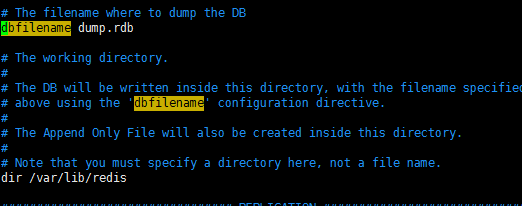

# 缓存相关

## redis和memcached的区别

​		相对于 Memcached，来说如果他断电了数

​			据也就没有了，不能像Redis一样支持数据的持久化，在这一点上Redis做的比他好，并且它包含了

​			Memcached的几乎所有的功能并且比他更加强大，作为Java来说Redis是一个不错的缓存数据库，

​			这只是Redis的一部分功能，还有更多的强大的功能，并且Memcached只支持json格式的字符串，	

​			但是Redis支持很多种数据类型，所以在现在的市场上Memcached已经逐渐被Redis取代了

## redis支持哪些数据结构

​		五种数据类型：

​						字符串（String）

​						哈希（hash）

​						字符串列表（list）

​						字符串集合（set）

​						有序字符串集合（zset       sorted set）

​		但是在Redis5.0中发布了新的数据类型

​			Stream data type 

## redis是单线程的么，所有的工作都是单线程么

​		Redis是单线程的，redis实际上是采用了线程封闭的观念，把任务封闭在一个线程，自然避免了线程安全问题，不过对于需要依赖多个redis操作的复合操作来说，依然需要锁，而且有可能是分布式锁。 所有的工作并不是单线程的，而是使用I/O的多路复用，


​		Redis 是跑在单线程中的，所有的操作都是按照顺序线性执行的，但是由于读写操作等待用户输入或输出都是阻塞的，所以 I/O 操作在一般情况下往往不能直接返回，这会导致某一文件的 I/O 阻塞导致整个进程无法对其它客户提供服务，而 I/O 多路复用就是为了解决这个问题而出现的 


​		那么什么是多路I/O的复用呢？		

​		多路指的是多个TCP连接，复用指一个或者多个线程进行处理，在Redis中是单线程的，简单的理解就是多个TCP连接进行数据写入的请求，通过一个单线程进行多路的IO写入，这个就是多路IO复用，但是I/O的多路复用也是有很多种模型的，常见的有、	select	 、  poll  	、epoll	

​		而在Redis当中使用的epoll

## redis如何存储一个String的

​		通过他的Key  Value的键值对进行存储，

## 一个key值如何在redis集群中找到存储在哪里

​		一个 Redis 集群包含 16384 个插槽（hash slot）， 数据库中的每
个键都属于这 16384 个插槽的其中一个， 集群使用公式 CRC16(key)
% 16384 来计算键 key 属于哪个槽， 其中 CRC16(key) 语句用于计
算键 key 的 CRC16 校验和 。
• 集群中的每个节点负责处理一部分插槽。 举个例子， 如果一个集群
可以有主节点， 其中：
节点 A 负责处理 0 号至 5500 号插槽。
节点 B 负责处理 5501 号至 11000 号插槽。
节点 C 负责处理 11001 号至 16383 号插槽。

​		那么redis如果有3个节点，就会根据他的key进行计算key的CRC16的值然后来对16384 进行取模的操作

​		也就是（Key 计算后的CRC16    %     16384），然后再计算取模后的值在哪一个节点中，例如取模后是3000，那么他就会找到3000的这个槽，3000的这个槽是在A节点（1-5500）（假设为3个节点），那么他就会在第一个节点进行存储，如果查找的话也会去第一个节点进行查询

## 缓存击穿

​		首先我们需要了解什么是缓存击穿。

​		缓存击穿是指我们在访问数据的时候加上了缓存，例如商城首页的热点数据，又或者是微博热点新闻，或者其他热点数据，我们对他进行了缓存，因为这部分的数据访问量较大，我们不能直接查询数据库，而是先从数据库中查询，然后缓存到缓存中间件或者本地中，当然这个缓存是有一个时间的，如果说这个时候刚好有很多用户来访问我们的热点数据，然后缓存刚好失效，那么这个时候就会有非常多的并发到我们的MySQL中，MySQL可能会由于请求过多崩溃或者其他异常导致不可用，这种情况下我们称之为缓存击穿。

## 缓存穿透

​		

## 缓存雪崩

​		

## redis持久化策略

### RDB

​					RDB的存储方式：在指定的时间间隔内将内存中的数据集快照写入磁盘，也
​						就是行话讲的Snapshot快照，它恢复时是将快照文件直接
​						读到内存里


​		Redis会单独创建（fork）一个子进程来进行持久化，会先将数据写入
​		到一个临时文件中，待持久化过程都结束了，再用这个临时文件替换
​		上次持久化好的文件。整个过程中，主进程是不进行任何IO操作的，
​		这就确保了极高的性能如果需要进行大规模数据的恢复，且对于数据
​		恢复的完整性不是非常敏感，那RDB方式要比AOF方式更加的高效。
​		RDB的缺点是最后一次持久化后的数据可能丢失


​		rdb的保存的文件： 在redis.conf中配置文件名称，默认为dump.rdb

​		


​		下面就是他的持久化的文件存储的路径


​		RDB持久化的保存策略

​		这是他的保存策略，如果60秒内发生了10000次数据操作则进行一次存储，

​		如果300秒发生了10次则会存入一次。如果900秒内发生了一次操作那么900秒后

​		就会备份一次，

​		

​		stop-writes-on-bgsave-error yes
​		当Redis无法写入磁盘的话，直接关掉Redis的写操作

​		rdbcompression yes
​		进行rdb保存时，将文件压缩

​		rdbchecksum yes
​		在存储快照后，还可以让Redis使用CRC64算法来进行数
​		据校验，但是这样做会增加大约10%的性能消耗，如果希
​		望获取到最大的性能提升，可以关闭此功能

​	rdb的备份

​					先通过config get dir 查询rdb文件的目录
​					将*.rdb的文件拷贝到别的地方

​			 	rdb的恢复

​			 		先把备份的文件拷贝到工作目录下
​		 			关闭Redis
​		 			启动Redis, 备份数据会直接加载

​				注：清先看清楚配置文件的RDB的文件名和路径

​	优点：

​					 节省磁盘空间
 					 恢复速度快

​	rdb的缺点

​					虽然Redis在fork时使用了写时拷贝技术,

​					但是如果数据庞大时还是比较消耗性能


​					在备份周期在一定间隔时间做一次备份，所以如果
​					Redis意外down掉的话，就会丢失最后一次快照后的所有修改	

### AOF

​	 AOF默认不开启，需要手动在配置文件中配置

​			 可以在redis.conf中配置文件名称，默认为 appendonly.aof

​			

​		这分别是是否开启。默认是关闭的而RDB默认是开启的，他的路径和RDB是一样的

​		下面这个就是文件名了

​		

​		那么如果RDB好AOF同时启动的话他会执行哪个呢？

​			AOF的备份机制和性能虽然和RDB不同, 但是备份和
​			恢复的操作同RDB一样，都是拷贝备份文件，需要
​			恢复时再拷贝到Redis工作目录下，启动系统即加载

​			**AOF和RDB同时开启，系统默认取AOF的数据**

​		持久化AOF

​			 AOF文件的保存路径，同RDB的路径一致

​			 如遇到AOF文件损坏，可通过
​				redis-check-aof --fix appendonly.aof 进行恢复


​		AOF优点：

​				恢复数据全，不会丢失数据

​		缺点：

​				占用磁盘空间较大，并且恢复没有RDB快

- 如果只配置AOF，重启时加载AOF文件恢复数据；
- 如果同时配置了RBD和AOF，启动是只加载AOF文件恢复数据;
- 如果只配置RBD，启动时将加载dump文件恢复数据。

## 你们用了redis，redis的底层数据结构了解多少？

​		简单动态字符串

​		链表

​		字典

​		跳跃表

​		整数集合

​		压缩列表

## 知道动态字符串sds的优缺点么？ 注:sds为redis底层数据结构之一

​	核心：

​		更加高效的执行长度计算：

​				在C中获取长度是需要进行遍历的，但是在sds中直接获取size属性，时间复杂度为O(1)，C的原生字符串获取长度为O(n)


​		更加高效的执行追加操作：

​				他在拓展的时候会比实际的多，例如追加10但是他扩容了15个，这样的话他下面5次追加就不会进行扩容了，而且他使用了惰性空间释放，也就是例如多出了10个空间他会把这10个记录下来，留着下次追加使用，而不是直接将10个空间进行释放，但是这样会让我们的内存空间变大，这个也可以手动进行释放（在SDS）的Api中有记录


​		二进制安全：

​				因为C字符串以空字符作为字符串结束的标识，而对于一些二进制文件（如图片等），内容可能包括空字符串，因此C字符串无法正确存取；而所有 SDS 的API 都是以处理二进制的方式来处理 buf 里面的元素，并且 SDS 不是以空字符串来判断是否结束，而是以 len 属性表示的长度来判断字符串是否结束。 


sds 会为追加操作进行优化：加快追加操作的速度，并降低内存分配的次数，代价是多占用了一些内存，而且这些内存不会被主动释放。

## redis的单线程特性有什么优缺点？

优点：	

1. 代码更清晰，处理逻辑更简单
2. 不用去考虑各种锁的问题，不存在加锁释放锁操作，没有因为可能出现死锁而导致的性能消耗
3. 不存在多进程或者多线程导致的切换而消耗CPU

缺点：

1. 无法发挥多核CPU性能，不过可以通过在单机开多个Redis实例来完善；

 

## 用过 Redis 的哪些数据结构, 分别用在什么场景?

### String

​			String类型他并不是只能存储String，也能用来存储Long，等等，他可以用来存储一些结构简单的数据，并且效率非常高，像日常的一些单个的值往里面存，例如用户的token，还有用户的信息

### Hash

​			Hash是一个字典类型，这个时候我们可以用它来存储一些需要频繁修改的对象，例如用户的积分（但一般也是在数据库中存储，Redis存储一般用来提高效率），那么我们需要对用户的积分进行改动，而且这种改动还比较频繁，那么我们可以使用Hash来进行存储这个用户对象，因为如果使用String的话他会全部的序列化出来再存储进去，这样造成的大量IO比较消耗性能

### List

​			List是一个列表，他其实是一个链表，但是更多的使用时是将他当做一个消息队列来使用，因为他可以push和pop这和Java中的Queue队列一样，我们可以使用它来做一个消息队列

### Set

​			Set是一个集合，他和Java中的Set也是一样的无序的不唯一的值，如果使用的话场景还是比较多的，例如向的好友列表，还有关注的用户，和粉丝，以及还能用来统计访问用户，比如统计某一天的用户访问量，和访问过的用户

### ZSet

​			ZSet是一个有序的集合，他可以用来存储集合并且做一个排序，那么我们可以使用他来进行一个点赞的操作，应为他去重并且有序，但实际上来说ZSet的应用场景其实并不多


​		这几个数据类型更多的是结合实际的业务需求来进行使用的


## 你们怎么解决缓存击穿问题的？

​		使用分布式锁，设置ex以及过期时间，然后进行数据库查询并重新添加到Redis中，没有获取到锁的对象Seelp睡眠一秒然后重新调用方法，这样就解决了缓存击穿的问题。

## Redis分布式锁注意事项

​		在使用Redis的锁的时候我们有非常多的注意事项，因为很有可能由于我们加锁的问题所引起的系统故障，主要的注意事项如下（大部分需要注意的事项，不是所有）：

​		1、setnx和expire的非原子性

​				在我们的业务场景中使用分布式锁，我们通常来说会去setnx来确定这个key是否存在，然后去设置他的超时时间，防止锁一直存在导致其他锁对象无法获取锁，但是这样是有问题的：

```
setnx
保存
不执行expire
```

​				那么我们刚刚setnx成功设置了锁，但是我们在要进行设置时间的时候抛出了异常，导致无法添加超时时间，其他的锁对象尝试获取锁一直获取不到导致程序线程请求累计，引起系统故障。

​				解决方案：

```
我们需要将设置值以及设置超时时间放到一起
在Redis2.6.12以上版本我们可以直接使用set将setnx和expire同时设置了如下所示
首先我们设置 一个key为lock的键然后他的值为1，然后超时时间两秒，设置类型为NX，那么这个相当于将setnx和expire一起设置了，这是一个原子性的操作
set lock 1 ex 2 NX

对于相应的API中，SpringDataRedis2.0以后也提供了相应的API去支持
```

​		2、解锁超时误解锁误删问题

​				那么在我们的设置锁的时候打个比方，我们有三个线程去获取锁，第一个线程去拿到锁，他将这个锁的超时时间设置成了2秒，那么我第二个线程进来没有获取到锁，进行等待，第一个锁还在执行中，2秒了他没有释放锁，但是这个锁过期了，我现在第二个锁获取到了这个锁，突然在这个时候，第一个锁执行完了，他来解锁了，实际上是我们的第二个锁的锁，第一个锁执行完后会直接将锁删除掉，那么第三个锁就开始执行了，这个时候我们的第二个锁和第三个锁是一起执行的，这样就导致了锁不住，以及锁误删的问题。

```
假设3个锁

		1、锁1获取锁执行程序
		2、锁1超时时间为2秒，但是2秒之后还没有执行完，这个锁已经超时了
		3、锁2获取锁，由于锁1超时所以可以拿到锁对象
		4、锁2拿到了锁对象，但是锁1执行完了代码，现在锁1要解锁了，把锁删掉了
		5、锁3笑咪咪的拿到了锁对象，此时锁2还在执行，这样就造成了锁1和锁2在同时执行，锁2和锁3也是同时执行的
```

​				解决方案：我们在set的时候将值设置为任务Id或者其他的唯一表示，在解锁的时候我们将设置的值和我们的id进行比较，如果这个锁是我们的我们进行解锁；

​				建议使用Lua脚本进行解锁，如果在代码中先Get然后判断值删除锁，有可能出现get的时候锁失效，然后还是误删的问题。

​				这里我们使用Lua脚本来进行删除，首先我们先获取这个KEY，然后根据这个KEY的值和传入的值进行比较，如何一样那么我们则删除原来的key，如果不一样则直接返回0即可。

​			首选我们先添加一个Key值为test

```
set test "test"
```

​			然后我们执行下面的代码，第一次执行我们会发现我们删除了，在执行一次则返回0

```
eval "if redis.call('get',KEYS[1]) == ARGV[1] then
        return redis.call('del',KEYS[1])
else
        return 0
end" 1 test "test"
```

​			3、master宕机丢锁问题

​					假设我们现在有两个线程去获取这个锁对象，我们假设他是锁1和锁2，那么首先我们进行模拟操作，锁1获取锁对象，在锁1获取到了锁对象之后，突然Master节点宕机，此时切换到丛节点，但是锁1的锁对象数据没有及时的同步到我们的锁2，那么这个时候锁1还在执行，锁2又来尝试获取锁对象，在这个时候由于从节点没有同步到Master的数据，那么锁2尝试从丛节点获取锁对象，这个时候是能够获取到的，那么就相当于这个时间我们的锁1和锁2都获取到了锁对象，这样就造成了锁不住，这也就是Master宕机丢锁的问题。

​					下面是执行的流程：

```
假设锁1和锁2，以及master和slave：
		1、首先锁1尝试获取锁对象，成功获得锁对象
		2、slave还没有从master同步数据，此时master挂掉了
		3、这个锁对象无法从master获取锁，切换到从节点
		4、锁2尝试获取锁对象，由于master宕机从节点无法同步到锁数据，锁2也成功获得锁对象
		5、引起锁问题，例如第二小节的锁误删问题，锁1执行完进行删锁，导致后面连续的锁对象混乱问题
```

​					解决方案：	

```
1、参考考虑下方的RedLock红锁机制进行实现，防止master宕机导致丢锁
2、使用其他的分布式锁方案进行解决，如Zookeeper或者MySQL（不推荐，Zk和MySQL的性能相比于Redis还是有一定的差距）
```


## RedLock红锁

​			首先，我们需要知道什么是RedLock红锁，由于在我们分布式场景下经常使用分布式锁，Redis作者antirez基于分布式环境下提出了一种更高级的分布式锁的实现方式。

​			为什么需要使用RedLock算法，因为我们在单Redis实例实现分布式锁的时候如果写入锁到Master，在这个过程中Master挂掉了，然后

​			RedLock概念：假设我们具有多个Redis节点，


## 项目中有用到过布隆过滤器么？在哪些场景使用的

​			首先我们需要先了解什么是布隆过滤器，布隆过滤器（Bloom Filter）是由Howard Bloom在1970年提出的一种比较巧妙的概率型数据结构，它可以告诉你某种东西**一定不存在**或者**可能存在**。当布隆过滤器说，某种东西存在时，这种东西可能不存在；当布隆过滤器说，某种东西不存在时，那么这种东西一定不存在。

​			布隆过滤器相对于Set、Map 等数据结构来说，它可以更高效地插入和查询，并且占用空间更少，它也有缺点，就是判断某种东西是否存在时，可能会被误判。但是只要参数设置的合理，它的精确度也可以控制的相对精确，只会有小小的误判概率。

​			 那么从上方的描述中我们可以总结出来几个比较重要的点：

```
					1、布隆过滤器是一种数据结构
					2、布隆过滤器说他存在时有可能不存在，说他不存在时一定不存在
					3、它可以更高效地插入和查询，并且占用的空间少
```

​			那么我们的布隆过滤器可以用在哪些场景下进行使用呢？

​						例如，防止缓存击穿、爬虫Url去重，过滤黑名单请求，


## redis缓存给了多大的内存，命中率有多高抗住了多少QPS

## 超大Value打满网卡的问题如何规避这样的问题

## 你过往的工作经历中，是否出现过缓存集群事故，说说细并说说高可用的保障的方案

