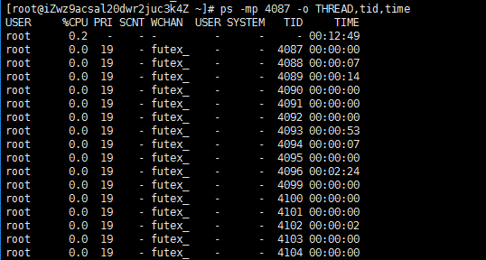

# 项目方面

## 介绍一下自己

​		首先简短的介绍自己：

​			你好我叫XXX，今年XX岁，面试的职位是XXX，以前在XXXX公司工作过X年，（根据实际情况，说学校以及）

## 讲讲项目经历

​		结合实际项目或者虚拟项目，划分模块2-3个，每一个模块所应用到的核心技术（如：Redis，Elasticsearch，MongoDB，FastDFS等等），然后是就是项目整体架构（例如：垂直结构（SSM），分布式架构（Dubbo），还有微服务架构（SpringCloud）），然后就是核心的功能，例如搜索，如何去进行搜索，有哪些比较有特点的代码，在做这个搜索模块中所遇到的问题，还有优化和容灾是如何进行，如果让你来设计这个搜索你会如何设计这个模块


## 你们项目中微服务是怎么划分的，划分粒度怎么确定？

​		答：这个是根据整体项目的架构大小来确认的，如果功能特别多特别复杂以及业务上面的区分来进行划分，例如：汽车销售平台中的和汽车相关的，在项目比较小的情况下并且业务划分不太多，比如汽车卖出去之后和汽车销售的统计，还有一些不太多的小功能（例如：规格参数和海报），那么这个就完全可以写到一个模块中，就叫做汽车模块，但是另一种场景，他需要汽车表的基本功能，还有统计，然后他还有一个需求，是保险方便的，车险需要购置保险，并且如果还有合同等等，这样的话就需要拆分成两个模块了，一个汽车模块。一个售后附加模块，更多的是根据业务来进行划分的

## 那在实践微服务架构中，有遇到什么问题么？

### Docker：

​	1、在使用Docker部署的时候一些特定不开放端口的服务，我们重新启动了Docker，这样会破坏Centos7的firewalld防火墙规则，这样这个端口还是会被访问的，例如我们先启动防火墙然后启动docker进行端口映射这样会造成规则破坏，导致端口号无法被防火墙拦截，造成安全隐患那么怎么解决呢（Centos7中会出现），原因是因为Docker在使用端口

​		解决博客

​		https://myforever.cn/blog/538872310925361152/550244603433844736/551125169477779456

### 数据库：

​	

### 项目：

​	1、Eureka的心跳机制问题，在项目中关闭了Eureka的心跳机制

​				

### 服务器：

​				

### 前后端交互：

​	1、分布式id前端精度丢失问题，在数据库中使用bigint数据类型，在项目实体类中使用Long类型，并且进行分布式id的生成，在前后端的数据传递过程中，由于前段long类型只能保存16位，而分布式id至少有19位，从而造成精度的丢失，而引起的数据不一致性

​	解决方案：

​		将实体类中的分布式字段id改成String类型，并且将分布式id生成改为idwork-str的String类型，这样就能解决了

## 你们在关于微服务间数据一致性问题，是如何解决的？

### 数据库方面：

​		在数据库主从复制的时候，所引起的主从延迟问题造成的数据库不一致，那么这个如何解决呢？

​		

## 自己做过哪些调优？JVM调优、数据库调优都行

​	数据库调优，主要是体现在数据库的索引优化上，对一些比较查询频繁的表和数据量比较大的表进行索引的优化，通过结合代码进行索引的创建，并且通过Mysql性能分析进行检查代码性能


​	**方案一：忽略**

​				任何脱离业务的架构设计都是耍流氓，绝大部分业务，例如：百度搜索，淘宝订单，QQ消息，58帖子都允许短时间不一致。如果业务能接受，最推崇此法。别把系统架构搞得太复杂。

​	**方案二：选择性主读**

​				将哪个库，哪个表，哪个主键三个信息拼装一个key设置到cache里，这条记录的超时时间，设置为“主从同步时延” ，画外音：key的格式为“db:table:PK”，假设主从延时为1s，这个key的cache超时时间也为1s。 这是要读哪个库，哪个表，哪个主键的数据呢，也将这三个信息拼装一个key，到cache里去查询， 在cache里记录哪些记录发生过写请求，来路由读主还是读从 


## 平时会用到哪些数据结构？

​		线型：

​			数组

​			队列

​			栈

​		树型：

​			B+树

​			红黑树

## RPC和HTTP的关系是什么？

​		RPC（即Remote Procedure Call，远程过程调用） 

​		HTTP（HyperText Transfer Protocol，超文本传输协议） 

​		他们最本质的区别，就是RPC主要工作在TCP协议之上，而HTTP服务主要是工作在HTTP协议之上，我们都知道HTTP协议是在传输层协议TCP之上的，所以效率来 说RPC肯定是要比HTTP效率更高得

## 谈一谈你对微服务架构的理解

​		主要是因为SOA（流式计算架构），微服务架构我们可以看成流式计算，并且将相应的功能模块拆分成一个个细微的服务，服务与服务之间可以相互调用，并且微服务可以很好的实现扩容缩容，Cloud也提供了一系列的技术解决方案，能够协调这些服务进行项目的构建以及运维

SpringCloudAlibaba

## 你用过哪些RPC框架，讲讲他们优缺点

​		Dubbo，只支持JAVA语言，不能支持其他语言的拓展，Dubbo只是实现了服务治理，其他组件需要另外整合以实现对应的功能，比如，分布式配置：可以使用淘宝的diamond、百度的disconf来实现分布式配置管理。服务跟踪：可以使用京东开源的Hydra，批量任务：可以使用当当开源的Elastic-Job，Dubbo的RPC来实现服务间调用的一些痛点，服务提供方与调用方接口依赖方式太强：调用方对提供方的抽象接口存在强依赖关系，需要严格的管理版本依赖，才不会出现服务方与调用方的不一致导致应用无法编译成功等一系列问题 ，服务对平台敏感，难以简单复用：通常我们在提供对外服务时，都会以REST的方式提供出去，这样可以实现跨平台的特点。 在Dubbo中我们要提供REST接口时，不得不实现一层代理，用来将RPC接口转换成REST接口进行对外发布。 

​		总结：

​				只支持Java不易于拓展

​				组件少，整合繁琐，对项目的构建来说难度会比较大

​				对接口的依赖高，并且需要严格的管理版本依赖

​				服务对平台敏感，难以简单复用：通常我们在提供对外服务时通常以REST方式提供

## 用过docker么，对容器了解多少

​		简单的了解和使用过，docker是一个容器虚拟化技术，他的三个核心是，镜像，容器，仓库，从仓库中下载镜像再通过镜像虚拟化容器到宿主机中，解决了开发环境的不一致的问题，并且他轻巧方便，并且有极高的稳定性


## 如何定位JAVA生产卡顿或卡死问题，如何定位解决问题

​		首先在Linux当中定位问题

​		首先查询是不是Java的问题导致的占用内存过高


```
top
```

​		那么我们查看例如4087（他只占用了0.7的CPU，但是生产的时候定位的时候肯定不是，模拟环境）

​		我们就定位到了4087他占用CPU就是这个Java进程，然后我们分析这个进程的线程

```
ps -mp 4087 -o THREAD,tid,time
```



​	我们可以看到线程的tid，我们找到例如4185这个线程，那么在内存中使用的是16进制，所以我们需要转换为16，把4185用计算器或者其他的转换为16进制，那么4185转换为16进制就是1059 ，但是在分析的时候需要使用字母必须为小写

jstack 4087 | grep 1059 -A60

然后通过进程id再跟踪线程tid进行分析

​	

这样就能找到对应的线程以及对应的类，以及错误行数了，然后进行代码的修改或者是优化

## 接口的如何处理重复请求（幂等性问题）

在项目中，那些数据是数据库和redis缓存双写一份的，如何保证双写一致性

